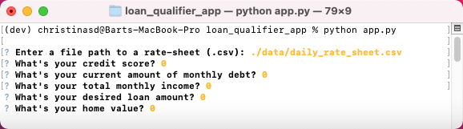

# Loan Qualifier Application
---


This is python command-line interface (CLI) application that gives users the ability to easily search for qualifying loans and save their search results as a new CSV file.  This allows results to be shared as a spreadsheet.
---

## Technologies

This project uses python 3.7 along with the following installed packages:

  * [fire](https://github.com/google/python-fire) - Python library for automatically generating CLI.

  * [questionary](https://github.com/tmbo/questionary) - Python library for building CLI.

---

## Installation Guide

First install the following packages:

```python
  pip install fire
  pip install questionary
```

---

## Usage

1. To begin saving your loan qualifier application to a CSV file simply clone the repository and run the **app.py** on the CLI:

```python
python app.py
```

2. Once you begin the loan qualifier application, you will be asked to provide a file path to a rate-sheet.  Here you will use:
> ./data/daily_rate_sheet.csv

3. To help the application filter through a list of qualifying loans, you will be asked a series of helpful information.  See below.



4. The user will also be given the option to save a copy of qualifying_loans as a CSV to view as a spreadsheet.

---

## Contributors

Christina San Diego
[  Email  ](mailto:christina.b.sandiego@gmail.com)[ LinkedIn ](https://www.linkedin.com/in/christinabuted)

---

## License

When you share a project on a repository, especially a public one, it's important to choose the right license to specify what others can and can't with your source code and files. Use this section to include the license you want to use.
